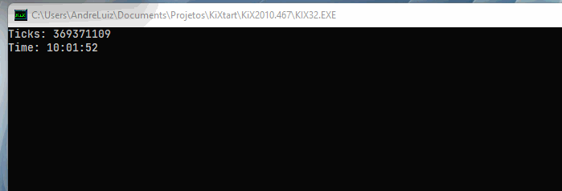

# ParallelsKix
Project aimed at injecting a means of parallel code execution, a language with no apparent support.

## Getting started 🧑‍🏫

It is necessary to download and install the [KiXtart 4.64](http://www.kixtart.org/binary/distrib/KiX2010.464.zip) **.dll** .
<br>Version **4.64** was chosen as it is the most stable **.dll** version..
<br><br>Copy **kixtart.dll**, to the system32/syswow64 folder (depending on your x86/x64 architecture).

~~~ batch
regsvr32 -i kixtart.dll
~~~

Installation of dependencies completed. ✔️

## First script with  ParallelsKiX

>*Ps:.
>Since it does not make any modification to reserved keywords, it is possible to use it without having to do a huge portability.*

<br>
Let's go to a practical code. 📑
<br><br>

~~~ vb
Break on
$=setOption(WrapAtEOL, On)

include "..\dep\AlsArray.udf"
include "..\dep\Constant.udf"
include "..\dep\Hash.Udf"
include "..\ParallelsKix.udf"
include "..\dep\FileIO.udf"

include_asyncFunc(@curdir+"\NavBar.kix")

$nav = NavBar("Time: ")

while true
    At(0,0)
	!GetTicks("Ticks: ")
    sleep 5
	At(1,0)
loop

Quit 0 ;;Extra_Code
Async NavBar($str)
	while true
		At(1,0)
		$str  @time"  "
		sleep 0.05
		At(0,0)
	loop
EndAsync

Async GetTicks($str)
	return = $str + @ticks
EndAsync
~~~

>*Note that the **include_asyncFunc** function serves to read the code and create the asynchronous functions that have its Async keyword, and parse the name **return =** to the function name.*

>*Note that when I call **GetTicks()** an exclamation mark is placed at the beginning of the call, as it is an asynchronous function, to call it synchronously, a **!** is placed at the beginning.*

>*Note that in GetTicks(), instead of putting a ```$GetTicks = $str + @ticks```, a ```return = $str + @ticks``` is put in, to keep a pattern between a synchronous and asynchronous call*

